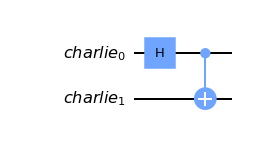

# Bell States

The prototypical entangled states of a two-qubit system, are maximally entangled qubits. Denoted: $\ket{\Psi^\pm}$ and $\ket{\Phi^\pm}$.

Bell-States/Bell-Pair/EPR Pair can be produced using Hadamrd gate and two-qubit Controlled-NOT (CNOT) gate.

