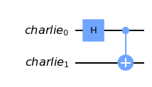
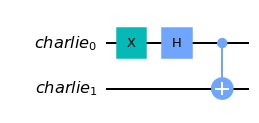
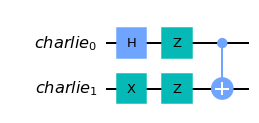

# Bell States

The prototypical entangled states of a two-qubit system, are maximally entangled qubits. Denoted: $\ket{\Psi^\pm}$ and $\ket{\Phi^\pm}$.

Bell-States/Bell-Pair/EPR Pair can be produced using Hadamrd gate and two-qubit Controlled-NOT (CNOT) gate.

The four Bell pairs:

$\ket{\Phi^+} = \frac{1}{\sqrt{2}} \Big( \ket{00} + \ket{11} \Big)$

$\ket{\Phi^-} = \frac{1}{\sqrt{2}} \Big( \ket{00} - \ket{11} \Big)$

$\ket{\Psi^+} = \frac{1}{\sqrt{2}} \Big( \ket{01} + \ket{10} \Big)$

$\ket{\Psi^-} = \frac{1}{\sqrt{2}} \Big( \ket{01} - \ket{10} \Big)$

