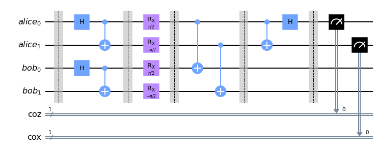
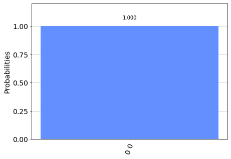

# Entanglement Purification

## __Table of Contents__

__[1. Optimized Entanglement Purification](#optimized-entanglement-purification)__

__[2. Design of a Quantum-Repeater using Quantum Circuits and Benchmarking Its Performance on an IBM Quantum Computer](#design-of-a-quantum-repeater-using-quantum-circuits-and-benchmarking-its-performance-on-an-ibm-quantum-computer)__

* [2.1. Bennett's Protocol](#bennetts-protocol---purification-of-noisy-entanglement-and-faithful-teleportation-via-noisy-channels)
* [2.2 Deutsch's Protocol](#deutschs-protocol---quantum-privacy-amplification-and-the-security-of-quantum-cryptography-over-noisy-channels)

## __[Optimized Entanglement Purification](https://quantum-journal.org/papers/q-2019-02-18-123/)__

Infidelity of created Bell pairs is on the order of 10% while noise due to local gates and measurements can be much lower than 1%.

## __[Design of a Quantum-Repeater using Quantum Circuits and Benchmarking Its Performance on an IBM Quantum Computer](https://link.springer.com/article/10.1007/s11128-021-03189-8)__

Bell states generated from and entanglement distribution scheme between two remote nodes are not perfect.

Losses can be mitigated by repeating the scheme severally, however, such systems are still prone to errors. Imperfections in the hardware used for state preparation and measurement introduce errors impossible to counter through repetition.

If entangled states are stored in quantum memeory, they become prone to dephasing i.e. releative phase between the qubits changes spontaneously.

Quantum purification procedures involves trying to generate a state that is known before hand, allowing us to distill a Bell state of higher fidelity from multiple copies of it.

### __Bennett's Protocol__ - [Purification of Noisy Entanglement and Faithful Teleportation via Noisy Channels](https://journals.aps.org/prl/abstract/10.1103/PhysRevLett.76.722)

It assumes that two copies of the Bell state have already been established between repeater nodes. At each node, both parties apply CNOT operation between the two entangled qubits. Thus in each pair, there's a control and target qubit.

The target qubit are then measured in the computational basis $\ket{0}, \ket{1}$. Measurement results are transmitted over a classical channel between the nodes.

Bell state is kept if measurement results agree e.g. $(0,0)$ or $(1,1)$.

If measurement results are different e.g. $(0, 1)$ or $(1, 0)$; purification protocol has failed and needs to be restart a fresh.

Protocol is `heralded`. Each node gets to know of the success status using a classical channel. Likely to be a performance bottleneck.

### __Deutsch's Protocol__ - [Quantum Privacy Amplification and the Security of Quantum Cryptography over Noisy Channels](https://journals.aps.org/prl/abstract/10.1103/PhysRevLett.77.2818)

Addresses shortcomings of `Bennett's Protocol`.

We reason using a Bloch Sphere. A qubit can be represented as a unit vector in 3-D space. This is called the Bloch vector of the state.

Using rotational unitary operations e.g. $R_x(\theta)$ which rotates a Bloch vector about x-axis by an angle $\theta$.

In this protocol, Alice performs rotation operation $R_x(\pi/2)$ on her qubits, while Bob performs the inverse rotation operation $R_x(-\pi/2)$. There after the two parties can perform CNOT operations as in Bennett's protocol, and proceeding with all other operations as in Bennett's protocol.

Quantum circuit design 2 Bell pairs - implementing Deutsch's protocol.

Result of the measurement in Deutsch's protocol for the above circuit.

Results $(0, 0)$ indicate successfull purification.
