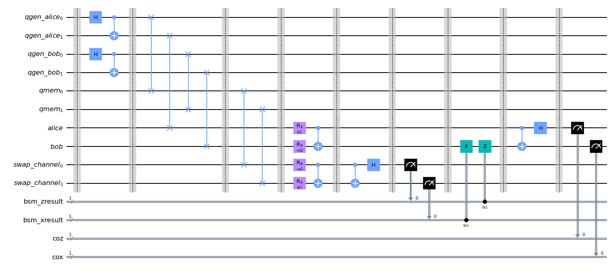

# Quantum Repeater

Complete architectural implementation of a full scale quantum repeater

## Step by step performance of a quantum repeater

Ref: [Design of a Quantum-Repeater using Quantum Circuits and Benchmarking Its Performance on an IBM Quantum Computer](https://link.springer.com/article/10.1007/s11128-021-03189-8)

1. Bell-Pairs creation
    - several Bell-Pairs are created between adjacent nodes through entanglement distribution.
2. Entanglement Purification
    - if necessary purification may be performed.
3. Entanglement swapping
    - two adjacent nodes with high fidelity qubits undergo swapping to produce a longer link.
4. If the destination is yet; the operatiosn from Step $2$ and Step $3$ are repeated sequentially until destination node and sender's node are linked.

## Quantum Repeater Architecture

Below os the circuit implementation of the quantum repeater circuit architecture.

The [quantum circuit code](../qrepeater/quantum_repeater.ipynb).

Node: the circuit below implements Deutsch's purification protocol.

